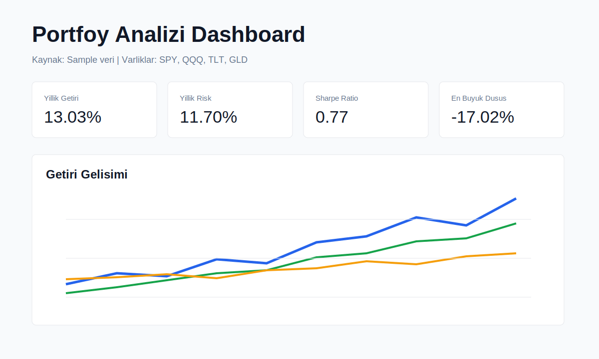

# Quant Portfolio Analytics Dashboard

An interactive Python and Streamlit project for portfolio risk, return, optimization, and Monte Carlo analysis. It is designed as a CV-ready financial data analysis project that demonstrates data ingestion, statistical analysis, visualization, and decision-support product thinking.



## Features

- Loads live ETF/stock data from Yahoo Finance without a dashboard sample-data mode.
- Keeps bundled sample data only for automated tests and offline development checks.
- Shows a simple decision summary for portfolio status, optimization opportunity, and risk reduction potential.
- Uses a guided sidebar flow for selecting assets, choosing data source, setting analysis profile, and reading next-step guidance.
- Calculates annualized return, volatility, Sharpe ratio, Sortino ratio, maximum drawdown, VaR, CVaR, and beta.
- Visualizes cumulative performance, rolling volatility, correlations, and portfolio weights.
- Generates random portfolios and highlights current, max-Sharpe, and minimum-volatility allocations.
- Shows allocation actions such as increase, reduce, or keep for each asset.
- Runs Monte Carlo simulations and presents low, median, and strong terminal-value scenarios.
- Includes CSV exports and an HTML report download.
- Includes deployment notes and CI-ready tests.
- Uses Yahoo Finance prices and optional Finnhub company/news enrichment in the dashboard.
- Keeps analytics logic in reusable modules with focused unit tests.

## Project Structure

```text
portfolio_analytics_dashboard/
  app.py
  requirements.txt
  README.md
  DEPLOYMENT.md
  NEXT_STEPS.md
  data/
    sample_prices.csv
  docs/
    screenshots/
      dashboard.svg
  src/
    providers/
      yahoo.py
      finnhub.py
    data_loader.py
    metrics.py
    optimization.py
    simulation.py
  tests/
    test_metrics.py
```

## Quick Start

```bash
cd portfolio_analytics_dashboard
python -m venv .venv
.venv\Scripts\activate
pip install -r requirements.txt
streamlit run app.py
```

The dashboard uses live market data. If Yahoo Finance cannot return data, the app shows a clear warning instead of falling back to sample data.

## Sidebar Workflow

1. Type a Yahoo Finance symbol into the sidebar search field and add it to the portfolio.
2. Review the portfolio list directly under the search field and remove symbols with the small `x` action next to each ticker.
3. Set the live data date range.
4. Choose a `Dengeli`, `Risk odakli`, or `Getiri odakli` interpretation profile.
5. Enter portfolio positions as lots; weights are calculated from latest prices.
6. Use the sidebar analysis guide to decide which dashboard tab to inspect first.

## Finnhub Setup

Create a local secrets file:

```toml
# .streamlit/secrets.toml
FINNHUB_API_KEY = "your_finnhub_api_key"
```

The real secrets file is ignored by Git. A safe template is available at `.streamlit/secrets.toml.example`.

Data source roles:

- Yahoo Finance: historical adjusted close prices.
- Finnhub: company profile and recent company news.
- Bundled sample data: used by tests only; it is not exposed as a dashboard data source.

## Improvement Roadmap Applied

1. Added a first-screen decision summary so the dashboard answers whether the portfolio looks balanced, watchable, or risky.
2. Simplified metric names and table labels for easier reading.
3. Turned optimization output into an action table that compares current and suggested weights.
4. Added scenario cards to the Monte Carlo tab.
5. Added a data summary section so the data source, date range, and observation count are visible.

## Suggested CV Bullet

Built an interactive portfolio analytics dashboard using Python, Pandas, Streamlit, and Plotly. Implemented risk-return metrics including Sharpe ratio, Sortino ratio, beta, volatility, maximum drawdown, VaR/CVaR, correlation analysis, Monte Carlo simulation, and Modern Portfolio Theory optimization.

## Suggested GitHub Description

CV-ready financial data analysis dashboard for portfolio risk, return, Monte Carlo simulation, and MPT optimization.

## Deployment

See [DEPLOYMENT.md](DEPLOYMENT.md) for Streamlit Cloud, Render, and CI notes.

## Next Steps

See [NEXT_STEPS.md](NEXT_STEPS.md) for the recommended development roadmap.
